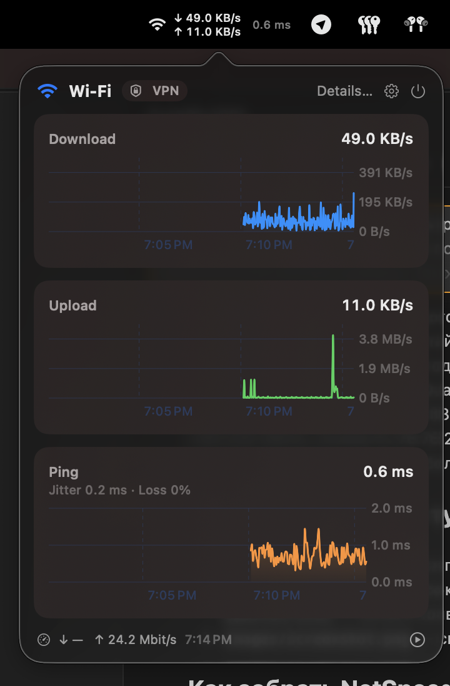

# NetSpeed MenuBar

Native macOS menu bar app (Swift / SwiftUI / AppKit hybrid) that shows live
network stats right in the menu bar, with a click-to-open history panel built
on Swift Charts and the Liquid Glass design language.



## Features

- **Connection-type icon** — Wi-Fi, Personal Hotspot (USB tethering), Ethernet,
  or offline, detected via `NWPathMonitor` + SystemConfiguration hardware-port
  names. Updates automatically when the network changes.
- **Stacked ↓/↑ speeds** — download on top, upload directly below, refreshed
  every second from kernel interface counters (`getifaddrs`), summed over all
  non-loopback interfaces.
- **Ping latency** — averaged over a configurable list of **labeled hosts**
  (ten well-known anycast resolvers out of the box: Cloudflare, Google, Quad9,
  OpenDNS, AdGuard, Yandex, Level 3, Verisign, CleanBrowsing, Control D),
  pinged in parallel every 3 seconds; **jitter** and **packet loss %** are
  shown under the Ping chart. Labels are editable inline in Settings. Failed
  pings are gaps in the data, never fake zero/negative points.
- **Speed test** — actual channel capacity (download/upload in Mbit/s),
  measured by loading the connection via Cloudflare's public speed-test
  endpoints: on demand from the panel or the Speed Test section, or
  automatically on an interval (15 min … 3 h, off by default). The passive
  menu-bar numbers show real current traffic — near zero when the machine is
  idle is correct; capacity requires an active test.
- **Click-to-open panel** — an `NSPopover` with three separate Swift Charts
  (Download, Upload, Ping): smoothed lines, gradient fills, auto-scaled Y axis,
  a time-based X axis, live 1-second updates while open. **Hover or drag** on
  any chart — in the panel and in the application window alike — to inspect
  the exact value and timestamp (lollipop annotation).
- **Menu bar styles** — Full (icon + stacked ↓/↑ + ping), Compact (icon + one
  line), or Icon only; switchable live from Settings.
- **Application window** (panel → Details…, or right-click menu):
  - **Network** — the physical carrier (Wi-Fi / Ethernet) shown separately
    from the **VPN tunnel**, so the real connection stays visible while a VPN
    routes traffic; the panel also shows a small VPN badge when a tunnel is
    active (detected via the default-route interface and `scutil --nc list`).
  - **Apps** — per-process ↓/↑ rates sampled from `nettop`, sorted by usage.
  - **Usage** — received/sent totals for the session, today, and this month,
    with a reset button; day/month aggregates persist across launches.
  - **Log** — connectivity outages with start time and duration, recorded
    from `NWPathMonitor` transitions, persisted (last 200 events).
- **Settings window** — gear button in the panel or right-click menu:
  - **Launch at Login** (`SMAppService`, needs the installed `.app`);
  - per-chart **units** for Download and Upload: Auto / Mbit/s / MB/s /
    Kbit/s / KB/s (Ping is always ms);
  - chart **time window**: 1 min / 5 min / 15 min / 1 hour (default 5 min),
    shared by all three charts; long windows are downsampled for smooth
    rendering.
  - All settings persist across launches.
- **Localized UI (EN / RU)** — follows the system language, including chart
  titles, connection types, units, and settings labels. Numbers use
  locale-aware formatting (decimal comma in Russian).
- **Liquid Glass UI** — system materials (`.regularMaterial`) and semantic
  colors only; no hard-coded colors or transparency, so the app automatically
  respects Reduce Transparency and picks up future Liquid Glass refinements.
- **Menu bar agent** — no Dock icon (`.accessory` activation policy). Quit from
  the panel or the right-click context menu.

## Requirements

- macOS 26+ (Apple Silicon)
- Xcode (used as the Swift toolchain only — no Xcode project needed)
- VS Code + the official [Swift extension](https://marketplace.visualstudio.com/items?itemName=swiftlang.swift-vscode)

## Build & run in VS Code

1. Open this folder in VS Code and install the recommended Swift extension
   (`swiftlang.swift-vscode`).
2. **Build:** `Cmd+Shift+B`, or `swift build` in the terminal.
3. **Run / debug:** `F5`, or `swift run` in the terminal. The app appears as a
   menu bar item (it is an agent — no Dock icon). Stop it with **Quit** in the
   panel / right-click menu, or by stopping the debug session.

> **Note (iCloud):** if the project lives inside iCloud Drive, keep build
> artifacts out of the synced folder, otherwise iCloud will try to sync
> thousands of files from `.build`. This repo expects `.build` to be a symlink
> to a folder outside the cloud:
>
> ```bash
> EXT="$HOME/Library/Developer/netspeed-menubar-build"
> mkdir -p "$EXT"
> ln -sfn "$EXT" ".build"
> ```

## Build a standalone app bundle

To get a regular `NetSpeed.app` you can keep in `/Applications` and launch
from Spotlight:

```bash
zsh scripts/bundle.sh
```

This builds a release binary, assembles `dist/NetSpeed.app` (ad-hoc signed,
`LSUIElement` — no Dock icon) including the SwiftPM resource bundle so
localization works inside the app, and prints the resulting path. In VS Code it
is also available as the **bundle NetSpeed.app** build task. Like `.build`,
`dist` is a symlink to a folder outside iCloud — the script creates it
automatically (iCloud's extended attributes would otherwise break strict
code-signature verification).

```bash
cp -R dist/NetSpeed.app /Applications/
open /Applications/NetSpeed.app
```

### The images/ folder

- `images/icon.png` — the app icon source: a square **1024×1024 PNG with an
  alpha channel** (transparent background). `scripts/bundle.sh` converts it
  into `AppIcon.icns` (via `sips` + `iconutil`) automatically; without the
  file the app builds with the generic icon.
- `images/screenshot.png` — the menu-bar screenshot referenced at the top of
  this README.

## Launch at Login

1. Build and install the app bundle as above (a bare binary cannot be a login
   item).
2. Open the panel → gear → **General** → enable **Launch at Login**.
3. The first time, confirm the login item in
   **System Settings → General → Login Items** if macOS asks.

### Alternative: manual LaunchAgent

1. Build a release binary:

   ```bash
   swift build -c release
   ```

2. Copy the binary somewhere stable (a path that does not change between
   builds), e.g.:

   ```bash
   mkdir -p ~/.local/bin
   cp "$(swift build -c release --show-bin-path)/NetSpeedMenuBar" ~/.local/bin/
   ```

3. Copy [com.user.netspeed.plist.example](com.user.netspeed.plist.example) to
   `~/Library/LaunchAgents/com.user.netspeed.plist` and replace the placeholder
   path with the binary location from step 2.

4. Load it:

   ```bash
   launchctl load -w ~/Library/LaunchAgents/com.user.netspeed.plist
   ```

## Localization

The UI is localized (English, Russian) and follows the system language. The
source of truth is the String Catalog
[Localization/Localizable.xcstrings](Localization/Localizable.xcstrings).
Command-line SwiftPM does not compile string catalogs (that is an Xcode
build-system feature), so the compiled `.lproj/Localizable.strings` files are
generated by `scripts/genstrings.sh` (requires Xcode) and committed under
`Sources/NetSpeedMenuBar/Resources/`. Re-run the script after editing the
catalog. Strings are resolved against `Bundle.module` — in a SwiftPM executable
target, resources never land in `Bundle.main`.

## Compatibility

Built for **macOS 26** (deployment target `macOS 26`). Uses only stable public
APIs (SwiftUI, AppKit, Swift Charts, Network, ServiceManagement,
SystemConfiguration, Darwin) and system materials / semantic colors, so it is
forward-compatible with **macOS 27**: the refined Liquid Glass appearance
(improved legibility, transparency controls) is adopted automatically without
code changes.

## Notes on ping accuracy

Ping RTT is parsed from `/sbin/ping` (`time=…`) as a fractional number — no
integer rounding, no dividing by 1000. Values under 10 ms keep one decimal so
small latencies don't collapse to "0 ms". A failed ping is a **gap** in the
chart (no point), never a `-1`/`0` sentinel; the Y axis starts at 0 and lines
use monotone interpolation, which cannot overshoot below the data minimum.
The app's numbers match `ping -c 5 <host>` in a terminal by construction —
it runs the same binary.

Sub-millisecond readings to internet hosts usually mean something local is
answering ICMP — typically an active VPN/proxy intercepting traffic (a real
internet round-trip cannot be ~0.5 ms). That is the system's genuine output,
not a parsing error; check the VPN badge in the panel.

The ↓/↑ numbers in the menu bar are **traffic actually flowing**, not channel
capacity. On an idle machine they correctly drop to bytes per second. To see
what the connection *can* do (what Speedtest-style sites report), use the
built-in **Speed Test** — it loads the link on purpose and reports Mbit/s.

## Limitations

- **Personal Hotspot over Wi-Fi is shown as Wi-Fi.** Without private APIs, a
  hotspot joined over Wi-Fi is indistinguishable from a regular Wi-Fi network,
  so no guessing heuristics are applied. USB tethering ("iPhone USB") **is**
  detected reliably via its hardware-port name.
- **Per-app traffic is an approximation.** There is no clean public API for
  per-process traffic without a NetworkExtension content filter, so the Apps
  section samples `nettop`; some system traffic may be unattributed. No
  privilege escalation is used.
- Ping uses the system `/sbin/ping` binary; if ICMP is blocked on your network,
  latency shows `—` and the chart has a gap.

## License

[MIT](LICENSE)
